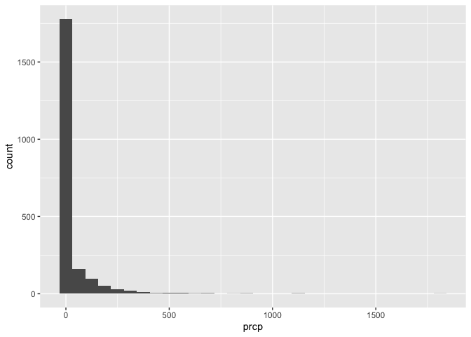

Exploratory Analysis
================
Mia Isaacs
2024-10-03

load packages

``` r
library(tidyverse)
```

    ## ── Attaching core tidyverse packages ──────────────────────── tidyverse 2.0.0 ──
    ## ✔ dplyr     1.1.4     ✔ readr     2.1.5
    ## ✔ forcats   1.0.0     ✔ stringr   1.5.1
    ## ✔ ggplot2   3.5.1     ✔ tibble    3.2.1
    ## ✔ lubridate 1.9.3     ✔ tidyr     1.3.1
    ## ✔ purrr     1.0.2     
    ## ── Conflicts ────────────────────────────────────────── tidyverse_conflicts() ──
    ## ✖ dplyr::filter() masks stats::filter()
    ## ✖ dplyr::lag()    masks stats::lag()
    ## ℹ Use the conflicted package (<http://conflicted.r-lib.org/>) to force all conflicts to become errors

``` r
library(patchwork)
library(haven)
```

load data

``` r
weather_df = 
  rnoaa::meteo_pull_monitors(
    c("USW00094728", "USW00022534", "USS0023B17S"),
    var = c("PRCP", "TMIN", "TMAX"), 
    date_min = "2021-01-01",
    date_max = "2022-12-31") |>
  mutate(
    name = case_match(
      id, 
      "USW00094728" ~ "CentralPark_NY", 
      "USW00022534" ~ "Molokai_HI",
      "USS0023B17S" ~ "Waterhole_WA"),
    tmin = tmin / 10,
    tmax = tmax / 10,
    month = lubridate::floor_date(date, unit = "month")) |>
  select(name, id, everything())
```

    ## using cached file: /Users/miaisaacs/Library/Caches/org.R-project.R/R/rnoaa/noaa_ghcnd/USW00094728.dly

    ## date created (size, mb): 2024-09-26 09:04:42.987907 (8.651)

    ## file min/max dates: 1869-01-01 / 2024-09-30

    ## using cached file: /Users/miaisaacs/Library/Caches/org.R-project.R/R/rnoaa/noaa_ghcnd/USW00022534.dly

    ## date created (size, mb): 2024-09-26 09:05:03.789332 (3.932)

    ## file min/max dates: 1949-10-01 / 2024-09-30

    ## using cached file: /Users/miaisaacs/Library/Caches/org.R-project.R/R/rnoaa/noaa_ghcnd/USS0023B17S.dly

    ## date created (size, mb): 2024-09-26 09:05:11.000259 (1.036)

    ## file min/max dates: 1999-09-01 / 2024-09-30

initial visualizations

``` r
weather_df |> 
  ggplot(aes(x = prcp)) + 
  geom_histogram()
```

    ## `stat_bin()` using `bins = 30`. Pick better value with `binwidth`.

    ## Warning: Removed 15 rows containing non-finite outside the scale range
    ## (`stat_bin()`).

<!-- -->

``` r
weather_df |> 
  filter(prcp>1000)
```

    ## # A tibble: 3 × 7
    ##   name           id          date        prcp  tmax  tmin month     
    ##   <chr>          <chr>       <date>     <dbl> <dbl> <dbl> <date>    
    ## 1 CentralPark_NY USW00094728 2021-08-21  1130  27.8  22.8 2021-08-01
    ## 2 CentralPark_NY USW00094728 2021-09-01  1811  25.6  17.2 2021-09-01
    ## 3 Molokai_HI     USW00022534 2022-12-18  1120  23.3  18.9 2022-12-01

``` r
weather_df |> 
  filter(tmax > 20, tmax < 30) |> 
  ggplot(aes(x = tmin, y = tmax, color = name, shape = name)) + 
  geom_point(alpha = .75)
```

<!-- -->

use group_by

``` r
weather_df |>
  group_by(name, month)
```

    ## # A tibble: 2,190 × 7
    ## # Groups:   name, month [72]
    ##    name           id          date        prcp  tmax  tmin month     
    ##    <chr>          <chr>       <date>     <dbl> <dbl> <dbl> <date>    
    ##  1 CentralPark_NY USW00094728 2021-01-01   157   4.4   0.6 2021-01-01
    ##  2 CentralPark_NY USW00094728 2021-01-02    13  10.6   2.2 2021-01-01
    ##  3 CentralPark_NY USW00094728 2021-01-03    56   3.3   1.1 2021-01-01
    ##  4 CentralPark_NY USW00094728 2021-01-04     5   6.1   1.7 2021-01-01
    ##  5 CentralPark_NY USW00094728 2021-01-05     0   5.6   2.2 2021-01-01
    ##  6 CentralPark_NY USW00094728 2021-01-06     0   5     1.1 2021-01-01
    ##  7 CentralPark_NY USW00094728 2021-01-07     0   5    -1   2021-01-01
    ##  8 CentralPark_NY USW00094728 2021-01-08     0   2.8  -2.7 2021-01-01
    ##  9 CentralPark_NY USW00094728 2021-01-09     0   2.8  -4.3 2021-01-01
    ## 10 CentralPark_NY USW00094728 2021-01-10     0   5    -1.6 2021-01-01
    ## # ℹ 2,180 more rows

counting stuff

``` r
weather_df |>
  group_by(month) |>
  summarize(n_obs = n())
```

    ## # A tibble: 24 × 2
    ##    month      n_obs
    ##    <date>     <int>
    ##  1 2021-01-01    93
    ##  2 2021-02-01    84
    ##  3 2021-03-01    93
    ##  4 2021-04-01    90
    ##  5 2021-05-01    93
    ##  6 2021-06-01    90
    ##  7 2021-07-01    93
    ##  8 2021-08-01    93
    ##  9 2021-09-01    90
    ## 10 2021-10-01    93
    ## # ℹ 14 more rows

``` r
weather_df |>
  group_by(name, month) |>
  summarize(
    n_obs = n(),
    n_dist = n_distinct(month))
```

    ## `summarise()` has grouped output by 'name'. You can override using the
    ## `.groups` argument.

    ## # A tibble: 72 × 4
    ## # Groups:   name [3]
    ##    name           month      n_obs n_dist
    ##    <chr>          <date>     <int>  <int>
    ##  1 CentralPark_NY 2021-01-01    31      1
    ##  2 CentralPark_NY 2021-02-01    28      1
    ##  3 CentralPark_NY 2021-03-01    31      1
    ##  4 CentralPark_NY 2021-04-01    30      1
    ##  5 CentralPark_NY 2021-05-01    31      1
    ##  6 CentralPark_NY 2021-06-01    30      1
    ##  7 CentralPark_NY 2021-07-01    31      1
    ##  8 CentralPark_NY 2021-08-01    31      1
    ##  9 CentralPark_NY 2021-09-01    30      1
    ## 10 CentralPark_NY 2021-10-01    31      1
    ## # ℹ 62 more rows

``` r
weather_df |>
  count(month, name = "n_obs")
```

    ## # A tibble: 24 × 2
    ##    month      n_obs
    ##    <date>     <int>
    ##  1 2021-01-01    93
    ##  2 2021-02-01    84
    ##  3 2021-03-01    93
    ##  4 2021-04-01    90
    ##  5 2021-05-01    93
    ##  6 2021-06-01    90
    ##  7 2021-07-01    93
    ##  8 2021-08-01    93
    ##  9 2021-09-01    90
    ## 10 2021-10-01    93
    ## # ℹ 14 more rows

2 x 2 tables

``` r
weather_df |> 
  drop_na(tmax) |> 
  mutate(
    cold = case_when(
      tmax <  5 ~ "cold",
      tmax >= 5 ~ "not_cold",
      TRUE      ~ ""
  )) |> 
  filter(name != "Molokai_HI") |> 
  group_by(name, cold) |> 
  summarize(count = n())
```

    ## `summarise()` has grouped output by 'name'. You can override using the
    ## `.groups` argument.

    ## # A tibble: 4 × 3
    ## # Groups:   name [2]
    ##   name           cold     count
    ##   <chr>          <chr>    <int>
    ## 1 CentralPark_NY cold        96
    ## 2 CentralPark_NY not_cold   634
    ## 3 Waterhole_WA   cold       319
    ## 4 Waterhole_WA   not_cold   395

``` r
weather_df |> 
  drop_na(tmax) |> 
  mutate(cold = case_when(
    tmax <  5 ~ "cold",
    tmax >= 5 ~ "not_cold",
    TRUE     ~ ""
  )) |> 
  filter(name != "Molokai_HI") |> 
  janitor::tabyl(name, cold)
```

    ##            name cold not_cold
    ##  CentralPark_NY   96      634
    ##    Waterhole_WA  319      395

# general numeric summaries

``` r
weather_df |>
  group_by(month) |>
  summarize(
    mean_tmax = mean(tmax, na.rm = TRUE),
    mean_prec = mean(prcp, na.rm = TRUE),
    median_tmax = median(tmax),
    sd_tmax = sd(tmax))
```

    ## # A tibble: 24 × 5
    ##    month      mean_tmax mean_prec median_tmax sd_tmax
    ##    <date>         <dbl>     <dbl>       <dbl>   <dbl>
    ##  1 2021-01-01     10.9       39.5         5     12.2 
    ##  2 2021-02-01      9.82      42.6         2.8   12.2 
    ##  3 2021-03-01     13.7       55.5        NA     NA   
    ##  4 2021-04-01     16.8       14.7        18.0    9.29
    ##  5 2021-05-01     19.6       17.3        22.2    9.40
    ##  6 2021-06-01     24.3       14.1        28.3    8.28
    ##  7 2021-07-01     25.2       30.7        28.3    6.19
    ##  8 2021-08-01     25.2       30.6        28.3    6.72
    ##  9 2021-09-01     22.4       35.4        24.4    7.69
    ## 10 2021-10-01     18.2       36.0        20.6   10.1 
    ## # ℹ 14 more rows

``` r
weather_df |>
  group_by(name, month) |>
  summarize(
    mean_tmax = mean(tmax),
    median_tmax = median(tmax))
```

    ## `summarise()` has grouped output by 'name'. You can override using the
    ## `.groups` argument.

    ## # A tibble: 72 × 4
    ## # Groups:   name [3]
    ##    name           month      mean_tmax median_tmax
    ##    <chr>          <date>         <dbl>       <dbl>
    ##  1 CentralPark_NY 2021-01-01      4.27         5  
    ##  2 CentralPark_NY 2021-02-01      3.87         2.8
    ##  3 CentralPark_NY 2021-03-01     12.3         12.2
    ##  4 CentralPark_NY 2021-04-01     17.6         18.0
    ##  5 CentralPark_NY 2021-05-01     22.1         22.2
    ##  6 CentralPark_NY 2021-06-01     28.1         27.8
    ##  7 CentralPark_NY 2021-07-01     28.4         28.3
    ##  8 CentralPark_NY 2021-08-01     28.8         28.3
    ##  9 CentralPark_NY 2021-09-01     24.8         24.4
    ## 10 CentralPark_NY 2021-10-01     19.9         20.6
    ## # ℹ 62 more rows

``` r
weather_df |>
  group_by(name, month) |>
  summarize(mean_tmax = mean(tmax, na.rm = TRUE)) |>
  ggplot(aes(x = month, y = mean_tmax, color = name)) + 
    geom_point() + geom_line() + 
    theme(legend.position = "bottom")
```

    ## `summarise()` has grouped output by 'name'. You can override using the
    ## `.groups` argument.

<!-- -->

format for readers

``` r
weather_df |>
  group_by(name, month) |>
  summarize(mean_tmax = mean(tmax, na.rm = TRUE)) |> 
  pivot_wider(
    names_from = name,
    values_from = mean_tmax) |> 
  knitr::kable(
    digits = 3,
    col.names = c("Month", "Central Park", "Molokai", "Waterhole"))
```

    ## `summarise()` has grouped output by 'name'. You can override using the
    ## `.groups` argument.

| Month      | Central Park | Molokai | Waterhole |
|:-----------|-------------:|--------:|----------:|
| 2021-01-01 |        4.271 |  27.616 |     0.800 |
| 2021-02-01 |        3.868 |  26.368 |    -0.786 |
| 2021-03-01 |       12.294 |  25.861 |     2.623 |
| 2021-04-01 |       17.607 |  26.567 |     6.097 |
| 2021-05-01 |       22.084 |  28.577 |     8.203 |
| 2021-06-01 |       28.057 |  29.587 |    15.253 |
| 2021-07-01 |       28.352 |  29.994 |    17.335 |
| 2021-08-01 |       28.810 |  29.523 |    17.152 |
| 2021-09-01 |       24.787 |  29.673 |    12.647 |
| 2021-10-01 |       19.926 |  29.129 |     5.481 |
| 2021-11-01 |       11.537 |  28.847 |     3.533 |
| 2021-12-01 |        9.587 |  26.190 |    -2.097 |
| 2022-01-01 |        2.855 |  26.606 |     3.606 |
| 2022-02-01 |        7.650 |  26.829 |     2.989 |
| 2022-03-01 |       11.990 |  27.726 |     3.416 |
| 2022-04-01 |       15.810 |  27.723 |     2.463 |
| 2022-05-01 |       22.255 |  28.283 |     5.810 |
| 2022-06-01 |       26.090 |  29.157 |    11.127 |
| 2022-07-01 |       30.723 |  29.529 |    15.861 |
| 2022-08-01 |       30.500 |  30.697 |    18.830 |
| 2022-09-01 |       24.923 |  30.413 |    15.207 |
| 2022-10-01 |       17.426 |  29.223 |    11.884 |
| 2022-11-01 |       14.017 |  27.960 |     2.140 |
| 2022-12-01 |        6.761 |  27.348 |    -0.460 |

# grouped mutates

``` r
weather_df |>
  group_by(name) |>
  mutate(
    mean_tmax = mean(tmax, na.rm = TRUE),
    centered_tmax = tmax - mean_tmax) |> 
  ggplot(aes(x = date, y = centered_tmax, color = name)) + 
    geom_point() 
```

    ## Warning: Removed 17 rows containing missing values or values outside the scale range
    ## (`geom_point()`).

<!-- -->

find hottest and coldest days

``` r
weather_df |>
  group_by(name, month) |>
  mutate(temp_rank = min_rank(tmax)) |> 
  filter(temp_rank < 10)
```

    ## # A tibble: 751 × 8
    ## # Groups:   name, month [72]
    ##    name           id          date        prcp  tmax  tmin month      temp_rank
    ##    <chr>          <chr>       <date>     <dbl> <dbl> <dbl> <date>         <int>
    ##  1 CentralPark_NY USW00094728 2021-01-08     0   2.8  -2.7 2021-01-01         8
    ##  2 CentralPark_NY USW00094728 2021-01-09     0   2.8  -4.3 2021-01-01         8
    ##  3 CentralPark_NY USW00094728 2021-01-11     0   2.8  -2.1 2021-01-01         8
    ##  4 CentralPark_NY USW00094728 2021-01-23     0   2.2  -4.3 2021-01-01         7
    ##  5 CentralPark_NY USW00094728 2021-01-24     0   0    -5.5 2021-01-01         3
    ##  6 CentralPark_NY USW00094728 2021-01-25     0   2.8  -4.9 2021-01-01         8
    ##  7 CentralPark_NY USW00094728 2021-01-26    25   1.1  -0.5 2021-01-01         5
    ##  8 CentralPark_NY USW00094728 2021-01-27     0   2.8  -0.5 2021-01-01         8
    ##  9 CentralPark_NY USW00094728 2021-01-28     0   1.1  -6.6 2021-01-01         5
    ## 10 CentralPark_NY USW00094728 2021-01-29     0  -3.8  -9.9 2021-01-01         1
    ## # ℹ 741 more rows

``` r
weather_df |>
  group_by(name, month) |>
  filter(min_rank(tmax) < 2)
```

    ## # A tibble: 92 × 7
    ## # Groups:   name, month [72]
    ##    name           id          date        prcp  tmax  tmin month     
    ##    <chr>          <chr>       <date>     <dbl> <dbl> <dbl> <date>    
    ##  1 CentralPark_NY USW00094728 2021-01-29     0  -3.8  -9.9 2021-01-01
    ##  2 CentralPark_NY USW00094728 2021-02-08     0  -1.6  -8.2 2021-02-01
    ##  3 CentralPark_NY USW00094728 2021-03-02     0   0.6  -6   2021-03-01
    ##  4 CentralPark_NY USW00094728 2021-04-02     0   3.9  -2.1 2021-04-01
    ##  5 CentralPark_NY USW00094728 2021-05-29   117  10.6   8.3 2021-05-01
    ##  6 CentralPark_NY USW00094728 2021-05-30   226  10.6   8.3 2021-05-01
    ##  7 CentralPark_NY USW00094728 2021-06-11     0  20.6  16.7 2021-06-01
    ##  8 CentralPark_NY USW00094728 2021-06-12     0  20.6  16.7 2021-06-01
    ##  9 CentralPark_NY USW00094728 2021-07-03    86  18.9  15   2021-07-01
    ## 10 CentralPark_NY USW00094728 2021-08-04     0  24.4  19.4 2021-08-01
    ## # ℹ 82 more rows

``` r
weather_df |>
  group_by(name, month) |>
  filter(min_rank(desc(tmax)) < 4)
```

    ## # A tibble: 269 × 7
    ## # Groups:   name, month [72]
    ##    name           id          date        prcp  tmax  tmin month     
    ##    <chr>          <chr>       <date>     <dbl> <dbl> <dbl> <date>    
    ##  1 CentralPark_NY USW00094728 2021-01-02    13  10.6   2.2 2021-01-01
    ##  2 CentralPark_NY USW00094728 2021-01-14     0   9.4   3.9 2021-01-01
    ##  3 CentralPark_NY USW00094728 2021-01-16   198   8.3   2.8 2021-01-01
    ##  4 CentralPark_NY USW00094728 2021-02-16   208  10.6   1.1 2021-02-01
    ##  5 CentralPark_NY USW00094728 2021-02-24     0  12.2   3.9 2021-02-01
    ##  6 CentralPark_NY USW00094728 2021-02-25     0  10     4.4 2021-02-01
    ##  7 CentralPark_NY USW00094728 2021-02-27    99  10     3.3 2021-02-01
    ##  8 CentralPark_NY USW00094728 2021-03-11     0  21.7   6.7 2021-03-01
    ##  9 CentralPark_NY USW00094728 2021-03-26    48  27.8  11.1 2021-03-01
    ## 10 CentralPark_NY USW00094728 2021-03-27     0  20.6  10   2021-03-01
    ## # ℹ 259 more rows

``` r
weather_df |>
  group_by(name) |>
  mutate(temp_change = tmax - lag(tmax))
```

    ## # A tibble: 2,190 × 8
    ## # Groups:   name [3]
    ##    name           id         date        prcp  tmax  tmin month      temp_change
    ##    <chr>          <chr>      <date>     <dbl> <dbl> <dbl> <date>           <dbl>
    ##  1 CentralPark_NY USW000947… 2021-01-01   157   4.4   0.6 2021-01-01      NA    
    ##  2 CentralPark_NY USW000947… 2021-01-02    13  10.6   2.2 2021-01-01       6.2  
    ##  3 CentralPark_NY USW000947… 2021-01-03    56   3.3   1.1 2021-01-01      -7.3  
    ##  4 CentralPark_NY USW000947… 2021-01-04     5   6.1   1.7 2021-01-01       2.8  
    ##  5 CentralPark_NY USW000947… 2021-01-05     0   5.6   2.2 2021-01-01      -0.5  
    ##  6 CentralPark_NY USW000947… 2021-01-06     0   5     1.1 2021-01-01      -0.600
    ##  7 CentralPark_NY USW000947… 2021-01-07     0   5    -1   2021-01-01       0    
    ##  8 CentralPark_NY USW000947… 2021-01-08     0   2.8  -2.7 2021-01-01      -2.2  
    ##  9 CentralPark_NY USW000947… 2021-01-09     0   2.8  -4.3 2021-01-01       0    
    ## 10 CentralPark_NY USW000947… 2021-01-10     0   5    -1.6 2021-01-01       2.2  
    ## # ℹ 2,180 more rows

``` r
weather_df |>
  group_by(name) |>
  mutate(temp_change = tmax - lag(tmax)) |>
  summarize(
    temp_change_sd = sd(temp_change, na.rm = TRUE),
    temp_change_max = max(temp_change, na.rm = TRUE))
```

    ## # A tibble: 3 × 3
    ##   name           temp_change_sd temp_change_max
    ##   <chr>                   <dbl>           <dbl>
    ## 1 CentralPark_NY           4.43            12.2
    ## 2 Molokai_HI               1.24             5.6
    ## 3 Waterhole_WA             3.04            11.1

# learning assessment

``` r
pulse_data = 
  haven::read_sas("./data/public_pulse_data.sas7bdat") |>
  janitor::clean_names() |>
  pivot_longer(
    bdi_score_bl:bdi_score_12m,
    names_to = "visit", 
    names_prefix = "bdi_score_",
    values_to = "bdi") |>
  select(id, visit, everything()) |>
  mutate(
    visit = replace(visit, visit == "bl", "00m"),
    visit = factor(visit, levels = str_c(c("00", "01", "06", "12"), "m"))) |>
  arrange(id, visit)

pulse_data |> 
  group_by(visit) |> 
  summarize(
    mean_bdi = mean(bdi, na.rm = TRUE),
    median_bdi = median(bdi, na.rm = TRUE)) |> 
  knitr::kable(digits = 3)
```

| visit | mean_bdi | median_bdi |
|:------|---------:|-----------:|
| 00m   |    7.995 |          6 |
| 01m   |    6.046 |          4 |
| 06m   |    5.672 |          4 |
| 12m   |    6.097 |          4 |

``` r
pup_data = 
  read_csv("./data/FAS_pups.csv") |>
  janitor::clean_names() |>
  mutate(sex = recode(sex, `1` = "male", `2` = "female")) 
```

    ## Rows: 313 Columns: 6
    ## ── Column specification ────────────────────────────────────────────────────────
    ## Delimiter: ","
    ## chr (2): Litter Number, PD ears
    ## dbl (4): Sex, PD eyes, PD pivot, PD walk
    ## 
    ## ℹ Use `spec()` to retrieve the full column specification for this data.
    ## ℹ Specify the column types or set `show_col_types = FALSE` to quiet this message.

``` r
litter_data = 
  read_csv("./data/FAS_litters.csv") |>
  janitor::clean_names() |>
  separate(group, into = c("dose", "day_of_tx"), sep = 3)
```

    ## Rows: 49 Columns: 8
    ## ── Column specification ────────────────────────────────────────────────────────
    ## Delimiter: ","
    ## chr (4): Group, Litter Number, GD0 weight, GD18 weight
    ## dbl (4): GD of Birth, Pups born alive, Pups dead @ birth, Pups survive
    ## 
    ## ℹ Use `spec()` to retrieve the full column specification for this data.
    ## ℹ Specify the column types or set `show_col_types = FALSE` to quiet this message.

``` r
fas_data = left_join(pup_data, litter_data, by = "litter_number") 

fas_data |> 
  group_by(dose, day_of_tx) |> 
  drop_na(dose) |> 
  summarize(mean_pivot = mean(pd_pivot, na.rm = TRUE)) |> 
  pivot_wider(
    names_from = dose, 
    values_from = mean_pivot) |> 
  knitr::kable(digits = 3)
```

    ## `summarise()` has grouped output by 'dose'. You can override using the
    ## `.groups` argument.

| day_of_tx |   Con |   Low |   Mod |
|:----------|------:|------:|------:|
| 7         | 7.000 | 7.939 | 6.984 |
| 8         | 6.236 | 7.721 | 7.042 |
